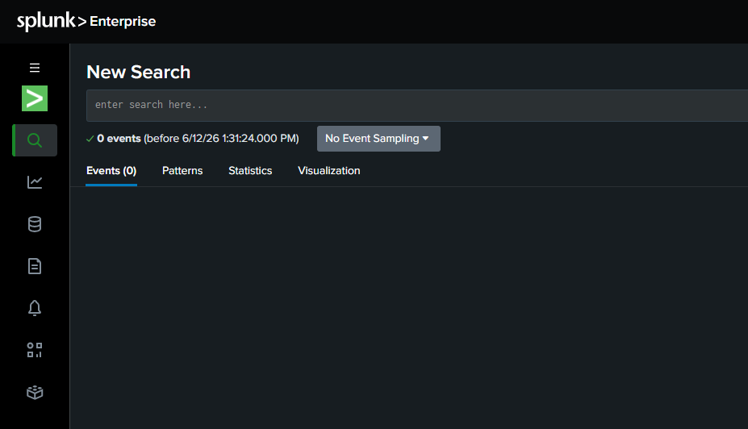
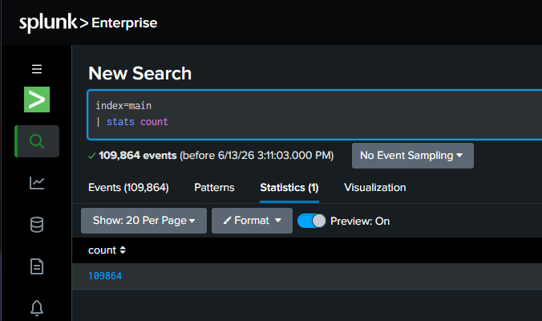
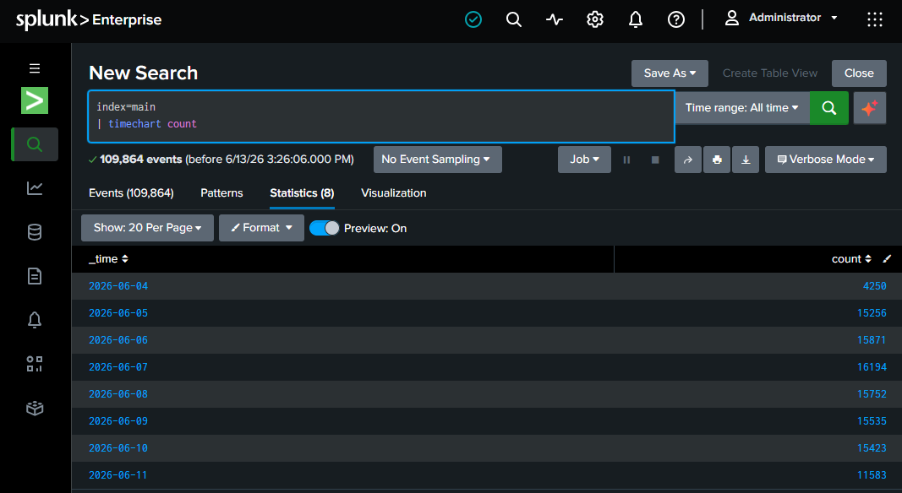
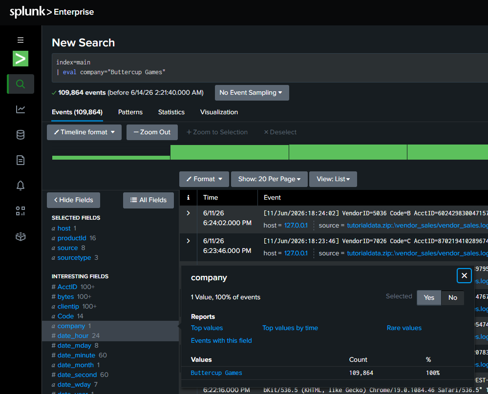
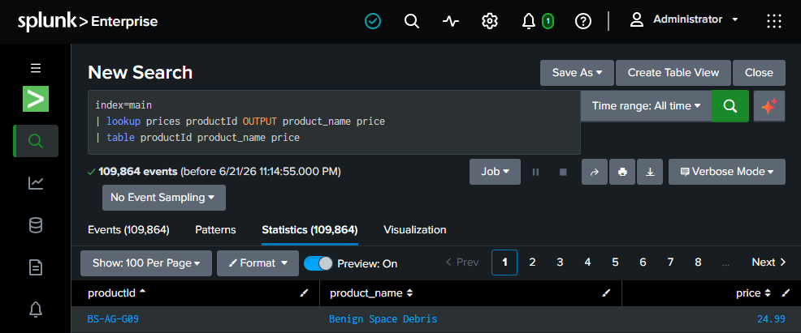
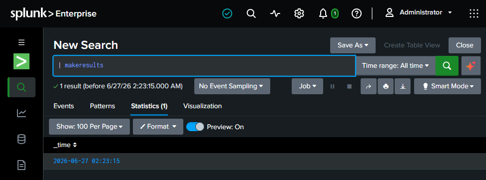

# Splunk SOC Analyst Detection & Investigation Lab

> A recruiter-ready Splunk portfolio project demonstrating Search Processing Language (SPL), log analysis, statistical investigation, field manipulation, and practical SOC detection workflows.


## Project overview

This repository turns my Splunk lab work into a structured security-operations portfolio. The project begins with core SPL search and data-manipulation skills and then applies those skills to analyst workflows such as failed-login analysis, brute-force detection, successful-login review, suspicious PowerShell activity, suspicious process execution, rare-process hunting, and network-connection analysis.

The emphasis is not just on writing searches. Each detection is documented with the security question being answered, the SPL logic, the expected signal, and the follow-up questions a SOC analyst should ask before deciding whether activity is malicious.

## Skills & Technologies

**SIEM & Security Operations**
- Splunk Enterprise
- Security Information and Event Management (SIEM)
- SOC Alert Triage
- Log Analysis
- Threat Detection
- Threat Hunting
- Security Investigation

**Splunk / SPL**
- Search Processing Language (SPL)
- stats
- eventstats
- streamstats
- timechart
- chart
- top
- rare
- eval
- rex
- regex
- where
- dedup
- lookups
- subsearches
- transactions
- multivalue functions

**Security Analysis**
- Authentication Monitoring
- Brute-Force Detection
- PowerShell Analysis
- Process Execution Analysis
- Parent/Child Process Analysis
- Network Connection Analysis
- Behavioral Baselining
- False-Positive Analysis
- Detection Tuning
- MITRE ATT&CK Mapping

## What this project demonstrates

- Building efficient SPL searches with filters, Boolean logic, pipes, `where`, `fields`, `table`, `sort`, `dedup`, `rex`, and `regex`.
- Summarizing and visualizing event data with `stats`, `chart`, `timechart`, `top`, `rare`, `eventstats`, and `streamstats`.
- Creating and transforming fields with `eval`, `if()`, `case()`, `coalesce()`, string functions, time functions, and multivalue functions.
- Working with lookups, correlation commands, subsearches, transactions, result modification, and macros.
- Investigating authentication anomalies and identifying high-volume failed-login sources.
- Detecting suspicious PowerShell command-line indicators and unusual parent/child process relationships.
- Hunting rare processes and reviewing command line, user, host, execution path, parent process, and network behavior.
- Using destination-port diversity and connection volume to identify potentially suspicious network behavior.

## SOC detection use cases

| Use case | Security question | SPL file |
|---|---|---|
| Failed login analysis | Which users or IPs generate the most authentication failures? | [`spl/01_failed_logins.spl`](spl/01_failed_logins.spl) |
| Brute-force detection | Which sources exceed a failed-login threshold? | [`spl/02_brute_force.spl`](spl/02_brute_force.spl) |
| Successful login review | Did a successful authentication follow suspicious failures? | [`spl/03_successful_logins.spl`](spl/03_successful_logins.spl) |
| PowerShell detection | Are encoded, hidden, bypass, or download-oriented PowerShell commands present? | [`spl/04_powershell_detection.spl`](spl/04_powershell_detection.spl) |
| Suspicious process execution | Did Microsoft Word launch PowerShell? | [`spl/05_suspicious_process_execution.spl`](spl/05_suspicious_process_execution.spl) |
| Rare process hunting | Which processes are least common in the environment? | [`spl/06_rare_processes.spl`](spl/06_rare_processes.spl) |
| Network anomaly review | Is a source touching many ports or producing excessive connections? | [`spl/07_network_connections.spl`](spl/07_network_connections.spl) |

## MITRE ATT&CK Coverage

Where the observed behavior supports a meaningful mapping, detections are aligned with the MITRE ATT&CK framework. ATT&CK mappings are used as investigative context rather than as proof that a specific adversary technique occurred.

| Detection | MITRE ATT&CK | Tactic |
|---|---|---|
| Brute-Force Detection | T1110 - Brute Force | Credential Access |
| Suspicious PowerShell Activity | T1059.001 - PowerShell | Execution |
| Successful Login After Suspicious Failures | T1078 - Valid Accounts | Defense Evasion / Persistence / Privilege Escalation / Initial Access |

Some hunting searches in this repository intentionally do not receive a direct ATT&CK technique mapping when the observed telemetry alone is insufficient to establish a specific adversary behavior. This avoids overstating what the evidence demonstrates.

## Featured evidence

The repository contains **all 81 screenshots extracted from the source lab PDF**. A few representative examples are shown here; the complete ordered collection is in [`docs/evidence-gallery.md`](docs/evidence-gallery.md).

### Search and filtering


**Objective:** Establish the initial search scope and identify relevant events for further investigation.

**Analyst Note:** This demonstrates the foundation of a Splunk investigation: selecting the appropriate dataset and filtering events before performing deeper analysis. In a SOC environment, narrowing the search early helps reduce noise and allows the analyst to focus on security-relevant activity.

**Security Relevance:** Effective filtering is essential during alert triage and threat hunting because analysts often need to isolate specific hosts, users, IP addresses, processes, or event types from large volumes of log data.

### Statistical analysis


**Objective:** Summarize event data with statistical commands to identify patterns, frequencies, and potentially unusual activity.

**Analyst Note:** Statistical analysis transforms raw Splunk events into meaningful results that are easier to investigate. Commands such as `stats` allow a SOC analyst to aggregate activity by fields such as user, source IP, host, process, or destination.

**Security Relevance:** Aggregating security events helps analysts identify high-volume sources, frequently targeted accounts, unusual processes, and other patterns that may not be obvious when reviewing individual raw events.

### Time-based analysis


**Objective:** Analyze how event activity changes over time and identify spikes, trends, or unusual periods of activity.

**Analyst Note:** Time-based analysis is important in security monitoring because suspicious behavior often becomes more visible when events are viewed chronologically. The `timechart` command helps transform raw events into a timeline that can reveal sudden increases or abnormal patterns.

**Security Relevance:** A sharp increase in events over a short period may indicate brute-force attempts, scanning activity, malware execution, authentication abuse, or another security event that deserves further investigation.

### Field manipulation


**Objective:** Create and transform fields to make raw event data more useful for security analysis.

**Analyst Note:** The `eval` command allows analysts to create calculated fields, modify existing values, and apply conditional logic to search results. This helps turn raw log information into fields that are easier to interpret during an investigation.

**Security Relevance:** Field manipulation can be used to classify events, normalize inconsistent data, calculate values, and create indicators that help distinguish normal activity from events requiring additional investigation.

### Lookups and correlation


**Objective:** Enrich Splunk event data with additional information to provide more context during an investigation.

**Analyst Note:** Lookups allow analysts to match fields from search results against external reference data, such as asset inventories, user information, IP classifications, or other contextual datasets. Correlating this information can make raw security events significantly more meaningful.

**Security Relevance:** Enrichment helps a SOC analyst determine whether an event involves a known asset, privileged user, suspicious indicator, or other important context. This additional information can improve alert triage and help analysts prioritize events that require deeper investigation.

### Multivalue analysis


**Objective:** Analyze fields containing multiple values and extract useful information from complex event data.

**Analyst Note:** Splunk multivalue functions allow analysts to work with fields that contain more than one value. Functions such as `split()`, `mvcount()`, and `mvindex()` can separate values, count them, or retrieve specific elements for further analysis.

**Security Relevance:** Security logs can contain multiple IP addresses, ports, users, processes, or other values within a single event. Multivalue analysis helps analysts break these fields apart and identify individual indicators that may require further investigation.

## Analyst workflow

The practical investigations in this repository follow a repeatable process:

1. **Define the question** - for example, “Which IP generated the most failed logins?”
2. **Narrow the data** - choose the relevant index, sourcetype, process, authentication phrase, or network field.
3. **Aggregate the signal** - use `stats`, `top`, `rare`, `timechart`, or distinct counts.
4. **Apply a threshold or filter** - use `where` to isolate the activity that deserves investigation.
5. **Add context** - review user, host, source IP, destination, process, command line, time, and related events.
6. **Validate before escalation** - account for legitimate causes and environment-specific baselines before treating a match as malicious.
7. 
## Detection & Investigation Lifecycle

Each security use case in this project follows a detection-engineering and SOC investigation mindset:

**Detection → Validation → Enrichment → Investigation → Assessment → Escalation**

A Splunk search result is treated as an investigative lead rather than automatic proof of malicious activity. Findings are validated using available context such as user identity, source and destination systems, process relationships, command-line activity, historical behavior, authentication events, and network telemetry.

This approach helps reduce false positives while preserving meaningful security signals that may require escalation.
## Repository structure

```text
splunk-soc-analyst-lab/
├── README.md
├── assets/
│   ├── image_manifest.csv
│   └── screenshots/                  # 81 source-lab screenshots
├── detections/
│   ├── 01-failed-logins.md
│   ├── 02-brute-force.md
│   ├── 03-powershell.md
│   ├── 04-suspicious-process.md
│   ├── 05-rare-process.md
│   ├── 06-network-connections.md
│   └── 07-successful-logins.md
├── docs/
│   ├── splunk-skill-map.md
│   ├── soc-investigation-notes.md
│   └── evidence-gallery.md
└── spl/
    ├── 00_spl_command_examples.spl
    ├── 01_failed_logins.spl
    ├── 02_brute_force.spl
    ├── 03_successful_logins.spl
    ├── 04_powershell_detection.spl
    ├── 05_suspicious_process_execution.spl
    ├── 06_rare_processes.spl
    └── 07_network_connections.spl
```

## How to reproduce the searches

Use a Splunk Enterprise or Splunk Cloud search environment containing fields comparable to the lab data. The examples in the source material primarily use `index=main`, Linux `sourcetype=secure` authentication events, web/tutorial data, and generic endpoint/network fields such as `process_name`, `parent_process`, `command_line`, `src_ip`, `dest_ip`, `dest_port`, and `protocol`.

Field names vary by data source. In a real environment, normalize the SPL to the fields produced by your Sysmon, Windows Event Log, EDR, firewall, authentication, or network telemetry before operational use.

## Detection engineering note

Thresholds in this project are **lab examples, not universal production rules**. A count such as 10 failed logins or 20 distinct destination ports can be useful for learning, but a production SOC should tune thresholds using its own baseline, authentication model, service accounts, scanners, administrative tools, and normal network behavior. The goal is to reduce false positives while preserving meaningful security signal.

## Portfolio Highlights

This project demonstrates the ability to:

- Translate security questions into SPL searches.
- Investigate authentication anomalies and potential credential attacks.
- Detect suspicious PowerShell execution patterns.
- Analyze parent-child process relationships.
- Perform frequency-based threat hunting.
- Investigate unusual network activity.
- Correlate multiple security events during investigations.
- Distinguish detection signals from confirmed malicious activity.
- Identify legitimate causes and potential false positives.
- Define investigation and escalation criteria.
- Apply detection tuning and behavioral baselining.
- Map appropriate security behaviors to MITRE ATT&CK.
- Document findings using a repeatable SOC investigation methodology.

## Documentation

- [`docs/splunk-skill-map.md`](docs/splunk-skill-map.md) - commands and concepts demonstrated across the lab.
- [`docs/soc-investigation-notes.md`](docs/soc-investigation-notes.md) - practical investigation questions and interpretation guidance.
- [`docs/evidence-gallery.md`](docs/evidence-gallery.md) - every screenshot from the source PDF, in page order.
- [`detections/`](detections/) - recruiter-friendly detection write-ups with SPL and triage logic.

---

**Portfolio focus:** Splunk | SPL | SIEM | SOC Analysis | Authentication Monitoring | Brute Force | PowerShell | Process Analysis | Threat Hunting | Network Analysis

## Disclaimer

This project was performed entirely within a **controlled laboratory environment** for educational, SOC training, and cybersecurity portfolio purposes.

All logs, events, detections, searches, thresholds, and investigation scenarios were used for training and demonstration purposes. The detection logic and thresholds documented in this project are lab examples and should be validated, baselined, and tuned before use in a production security environment.

No real-world systems, organizations, user accounts, or third-party data were targeted or compromised during this project.

---

## Author

**Anik Nohan**

This hands-on Splunk SOC Analyst Detection & Investigation Lab was completed to demonstrate practical skills in:

- Splunk Enterprise and Search Processing Language (SPL)
- SIEM monitoring and SOC alert triage
- Security log analysis and investigation
- Authentication monitoring and failed-login analysis
- Brute-force detection
- Successful-login investigation
- Suspicious PowerShell activity detection
- Process and parent-child process analysis
- Rare-process threat hunting
- Network connection analysis
- Statistical and time-based event analysis
- Field extraction, manipulation, and enrichment
- Behavioral baselining and false-positive analysis
- Detection tuning and validation
- MITRE ATT&CK mapping
- SOC investigation and escalation methodology
- Security investigation documentation

### Tools & Frameworks

`Splunk Enterprise` • `SPL` • `SIEM` • `MITRE ATT&CK` • `GitHub`

---

